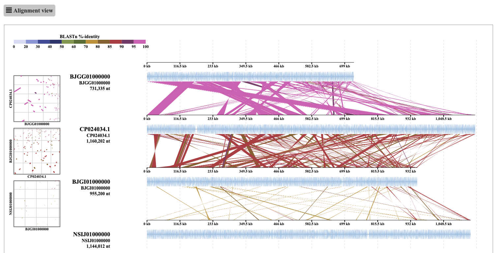
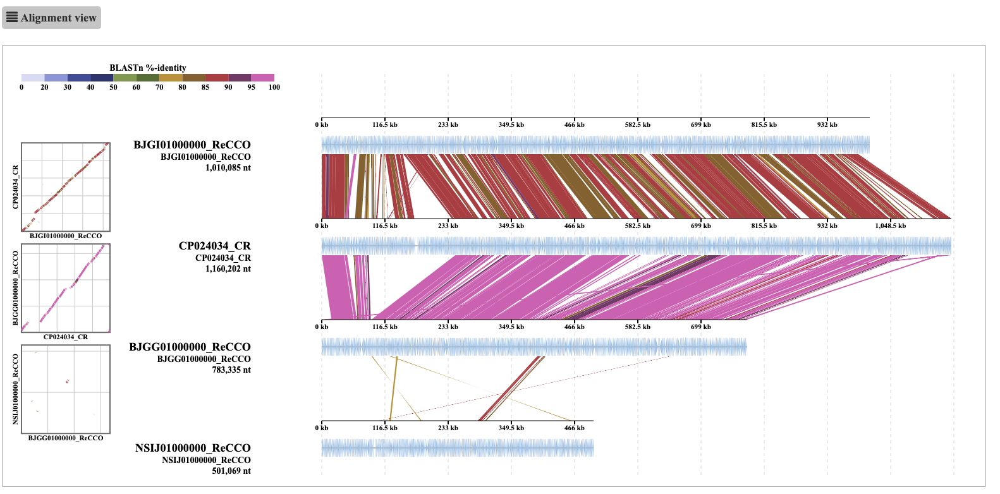

# ReCCO 

### About ReCCO
ReCCO: To Reverse Complement and Concatenate contigs in Order.

This tool aims to improve the usability of DiGAlign, a genome alignment viewer that computes and interactively visualizes the alignments of your input nucleotide sequences.

### Objective
ReCCO is developed to allow DiGAlign to compare genomes consisting of multiple contigs. By default, DiGAlign takes a multi-fasta nucleotide file as an input, and aligns the individual sequences to each other. When the user wants to compare multi-contig genomes, the contigs of each genome need to be concatenated before input to DiGAlign. However, in many cases, the order and orientation of the contigs in a genome are unknown. Thus, a simple concatenation of the contigs without rearrangement would result in alignments of segments with mixed order and orientation, which would look like below:




ReCCO solves this problem by flipping and reordering contigs before the concatenation based on an alignment against a reference genome provided by the user (usually the best-quality assembly in the dataset). The alignment of the ReCCO output from the same input genome looks like this:



### Workflow

1. The user needs to prepare input nucleotide fasta files to be compared to each other. Each fasta file should contain contigs of a genome. From the input files, the user needs to determine one reference file, which is usually the best-quality assembly in the dataset.
2. ReCCO takes the reference and query nucleotide fasta files as an input. If the reference is a multi-fasta file, the contigs are concatenated without rearrangement. 
3. Each of the contigs from the query fastas are aligned to the concatenated reference sequence using BLASTn.
4. The longest alignment is selected for each query contig. 
5. For each query genome, the contigs are sorted based on the alignment start positions. The contig is flipped to the reverse complement if it is aligned to the reference in the opposite orientation.
6. For each query genome, the rearranged query contigs are concatenated with the insertion of the user-determined number (default=1000) of "N" bases at each concatenated site. Contigs unaligned to the reference are concatenated at the end of the aligned contigs.

### Installation

* To run ReCCO, the following tools are required in the user's environment:
  * Python
  * Biopython 
  * BLAST+ 

* To install ReCCO, just download the python script and place it in an executable directory.

### Usage 
- **-i:** Input directory: Directory containing both query and reference fasta files. The extensions of the files should be .fasta, .fa, or .fna (Required)　
- **-r:** Reference file: Name of the user-determined reference file. (Required)
- **-o:** Output directory: Directory where the user wishes to output files. (Required) 
- **-n:** Number of n: Number of Ns to be inserted at the concatenated sites. (Default: 1000) 
- **-s:** Suffix: Suffix for the concatenated query contigs. (Default: "_ReCCO")
- **-m:** Minimum length: Minimum length of input contigs to be retained in the output. Default: 0
- **-b:** Blast bin directory: Path to the directory of the blastn executable. (Required if it is not in the environment) 

#### Example:
You can download the example files here: [XXXX] 

```python ReCCO.py -i Example_files/ -r CP024034.fasta -o output ``` 

### Output
Below the output directory, there will be a file named "ToDiGAlign.fasta" and two directories named "blast_results" and "edited_fasta_file".

* ToDiGAlign.fasta

  * A file containing the concatenated reference and query genomes. This can be directly used as an input to DiGAlign.
  * The concatenated query sequences are renamed by adding the user-defined suffix (with "-s" option) to the original file name.
  * The reference sequence is renamed by adding "_CR" (Concatenated Reference) as the suffix to the original file name.

* "edited_fasta_file" directory

  * The concatenated reference and query genomes output as separate files.

* "blast_results" directory

  * The BLASTn output (outfmt 6) used for rearrangement of the contigs containing only the longest hit of each contig.

#### Backup function
When the output directory (given by the -o option) already exists, the user will be asked whether to create a backup directory before overwriting the output directory.

### Version history

* 2023-xx-xx: v1.0-beta Initial release of ReCCO

### Developer
* Peijie Yan, Kyoto University
